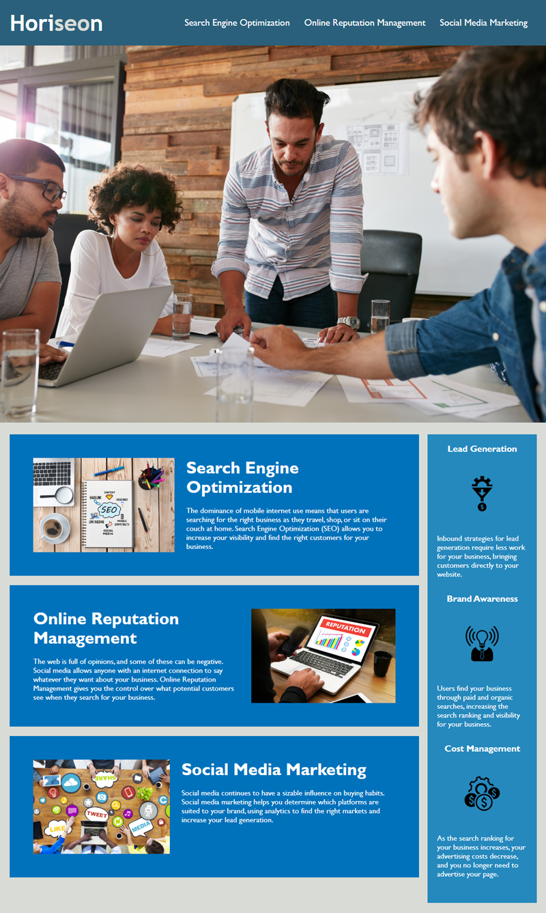

# horiseon-refactor-ch1
# Horiseon Webpage Refactored to be More Accessible

## Description
The Horiseon website HTML and CSS has been made more accessible. That is, the HTML and CSS have been refactored to ensure that people with disabilities will be able to access this website using assistive technologies such as video captions, screen readers, and braille keyboards. 

The Mock Up shows a screenshot of the original website. The refactored website should look like the original website when completed.

### User Story
AS A marketing agency

I WANT a codebase that follows accessibility standards

SO THAT our own site is optimized for search engines

### Acceptance Criteria
GIVEN a webpage meets accessibility standards

WHEN I view the source code

THEN I find semantic HTML elements

WHEN I view the structure of the HTML elements

THEN I find that the elements follow a logical structure independent of styling and positioning

WHEN I view the image elements

THEN I find accessible alt attributes

WHEN I view the heading attributes

THEN they fall in sequential order

WHEN I view the title element

THEN I find a concise, descriptive title

### Mock Up
Screenshot of the Horiseon website. 

## Installation/Execution

There are 3 navigation items in the website's header. When they are selected, the website should respond as follows:

Search Engine Optimation - your view moves to the section titled Search Engine Optimization
Online Reputation Management - your view moves to the section titled Online Reputation Management
Social Media Marketing - your view moves to the section titled Social Media Marketing

## Usage

## Credits

N/A

## License

N/A
